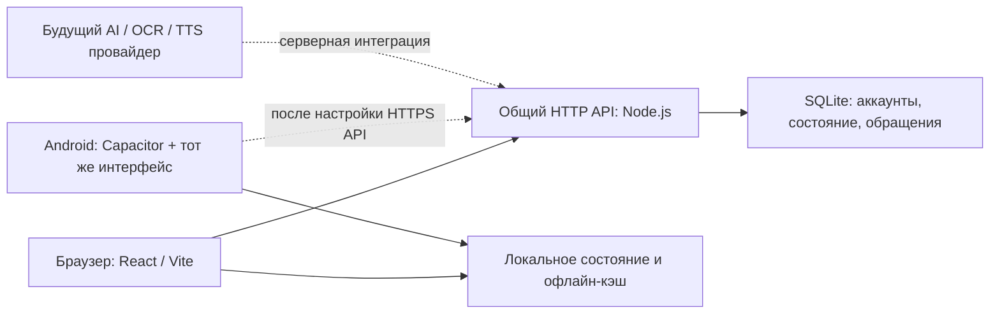

# Talkora: архитектура и границы первой реализации

Этот репозиторий развивает интерактивный прототип в рабочую локальную основу приложения. Наличие экрана, API или Android-конфигурации само по себе не означает готовность сервиса к публичному запуску. Точный объём требований и незавершённые части перечислены в [REQUIREMENTS.md](REQUIREMENTS.md) и [ROADMAP.md](ROADMAP.md).

## Один учебный интерфейс для двух платформ

- React, TypeScript и Vite обслуживают адаптивный веб-интерфейс: компьютер, мобильный браузер и web view Android.
- Capacitor упаковывает сборку `dist` в Android-приложение. `capacitor.config.ts` задаёт `app.talkora.learn`, имя Talkora и локальную HTTPS-схему web view. Удалённый `server.url` не задан: интерфейс поставляется с приложением.
- Web App Manifest задаёт название, оригинальный знак, цвета и отдельное окно для поддерживающих установку браузеров. Manifest не заменяет проверку офлайн-режима и установки на реальных устройствах.
- Общая серверная часть использует Node.js 24, HTTP API и SQLite. Все клиенты должны обращаться к одному развёрнутому API, чтобы работать с одним аккаунтом и его данными.



## Данные и расширяемость

Первое направление обучения — `ru → en`. Язык интерфейса, исходный язык и изучаемый язык — разные свойства; в будущем их нельзя сводить к одной переменной `language`. Уровень CEFR — атрибут учебного этапа, а не сертификат, выдаваемый коротким тестом.

В приложении нужны следующие самостоятельные сущности:

| Область | Данные и назначение |
| --- | --- |
| Аккаунт | Идентификатор, уникальный ник, пароль или привязка внешнего провайдера, сессии |
| Настройки | Возрастная группа, несколько целей, язык интерфейса, расписание, уведомления |
| Контент | Языковая пара, арена, урок, упражнения, правила, словарные карточки, редакционный статус |
| Прогресс | Ответы, завершённые уроки, ошибки, открытые арены, результаты тестов |
| Повторение | Личные слова, перевод пользователя, знакомые слова, трудность, дата следующего повторения |
| Мотивация | Очки, серия, валюта, достижения, недельный результат |
| Обратная связь | Категория, описание, ссылка на материал, статус обработки |

В текущем сервере созданы таблицы `users`, `user_states`, `sessions` и `support_reports`; файл по умолчанию — `data/talkora.sqlite`. `DB_PATH` меняет путь к базе. Включены внешние ключи, каскадное удаление привязанных записей и WAL. Пользовательское состояние хранится JSON-документом с версией. Это ускоряет проверку сценариев, но не является окончательной моделью для конкурентного редактирования и больших объёмов. Перед публичной синхронизацией следует выделить события обучения и отдельные записи слов, использовать миграции схемы и версионирование контента. Настройки возраста и целей не должны менять идентичность аккаунта или обнулять прогресс.

Реализованные группы API: `/api/auth/register`, `/api/auth/login`, `/api/auth/logout`, `/api/session`, `/api/state`, `/api/support` и `/api/account`. Пароли хешируются через scrypt с индивидуальной солью; случайная сессия передаётся в HttpOnly cookie, в базе хранится хеш токена. Это техническая основа локального входа, а не замена проверке безопасности перед публичным выпуском.

## Синхронизация и офлайн

Для одного развёрнутого сервера веб-клиенты используют одни серверные аккаунты. `GET /api/state` возвращает состояние и версию, а `PUT /api/state` обновляет документ только при совпадении версии. Устаревшая запись получает `409` и актуальный серверный снимок, что предотвращает молчаливое перезаписывание на сервере. Клиентская политика слияния и повторной отправки требует отдельных испытаний на двух устройствах. Локальное сохранение и последующая отправка состояния позволяют продолжать часть действий при сбое сети; они не доказывают безопасное разрешение всех конфликтов.

Целевая модель синхронизации для выпуска:

1. Каждое завершение урока и изменение слова получает уникальный идентификатор операции и привязку к аккаунту.
2. Клиент сохраняет операцию в устойчивую очередь и применяет локально.
3. Сервер проверяет операцию, обрабатывает её идемпотентно и возвращает новую ревизию.
4. Клиент запрашивает изменения после известной ревизии и явно разрешает конфликты редактирования слов.
5. Очередь и кэш разделены по аккаунтам; выход и удаление аккаунта очищают приватные локальные данные.
6. Загружаемый пакет арены содержит версию, упражнения, объяснения и доступное аудио. Следующий пакет загружается заранее при наличии сети и свободного места.

Статический кэш приложения не равен полному офлайн-курсу. Отдельно требуются тесты повторного запуска без сети, учебного контента, пакетов аудио, удаления кэша, смены аккаунта и повторной отправки результатов. Генерация AI и распознавание без скачанной локальной модели требуют сети.

## Android и подключение к серверу

После сборки веб-клиента используются стандартные операции Capacitor:

```text
npm run build
npx cap add android      # только один раз, если каталога android ещё нет
npx cap sync android
npx cap open android
```

Команды описывают процесс подготовки проекта, а не подтверждают, что Android APK уже собран. Для сборки нужны совместимые Android Studio, SDK и JDK; точные версии следует брать из установленной версии Capacitor и созданного Gradle-проекта.

`https://localhost` внутри Capacitor обслуживает файлы приложения на самом устройстве. Это не адрес Node.js-сервера на компьютере разработчика. Относительный `/api` в Android сам по себе не достигает серверной части. Перед рабочей сборкой нужно настроить адрес общего HTTPS API, разрешённые origins и транспорт авторизации. В браузере желательно обслуживать интерфейс и API на одном origin через reverse proxy. Native-клиенту требуется отдельно проверенная работа сессий или безопасного токена; нельзя предполагать, что браузерные cookie автоматически работают между разными origins.

В текущей конфигурации намеренно нет скрытого перенаправления на внешний сайт, отключения TLS-проверок или общего разрешения cleartext. URL API — открытый адрес, а серверные секреты, OAuth client secrets и ключи AI нельзя включать в Vite-переменные или Android bundle. `server.url` предназначен для сценариев разработки и не заменяет пакет интерфейса с рабочей офлайн-логикой. [Официальная схема Capacitor config](https://capacitorjs.com/docs/config).

## Учебный контент, AI и качество

Стартовый набор упражнений позволяет проверить механики обучения. Сервер пересчитывает его результат по опубликованным ответам и не разрешает клиенту напрямую повысить уровень или стартовую арену, но восемь вопросов A1–A2 не являются валидированным адаптивным тестом. Набор не заменяет большую редакционно проверенную программу A1–C2. Тематические тренировки на готовых шаблонах должны называться тренировками из библиотеки; без подключённой модели нельзя выдавать их за генерацию произвольной темы.

Будущая серверная генерация разделяется на создание и независимую проверку. До показа проверяются структура, уникальность правильного ответа, переводы, грамматика, понятность объяснения, уровень и возрастная безопасность. Ошибка проверки ведёт к пересозданию или отказу с понятным сообщением, а не к публикации непроверенного материала. Для основного курса дополнительно обязателен редакторский статус `approved/published` и журнал изменений.

OCR должен сначала вернуть редактируемый предварительный результат. Переводы пользователя сохраняются приоритетно. Загружаемые файлы требуют проверки типа и размера, ограничений обработки, удаления временных материалов и защиты от содержимого, пытающегося изменить инструкции генератора. Данные пользователя не должны становиться общедоступным контентом.

Browser Speech Synthesis может озвучивать английские фразы, если доступен подходящий голос. `en-GB` — запрос предпочтительного голоса, а не гарантия качественной британской озвучки, поддержки офлайн или наличия голоса на каждом устройстве. Для выпуска нужен проверенный набор аудиофайлов или TTS-провайдер с кэшированием и лицензией на использование.

## Что требуется серверу перед публичным запуском

- HTTPS, домен, явный список разрешённых origins, безопасные cookies/токены, CSRF-защита для cookie-сессий, rate limits и журналирование без паролей и приватных списков слов.
- Подтверждение почты, восстановление доступа, настройка Google/Apple OAuth, безопасные redirect URI и проверка токенов на сервере. Секреты хранятся только на сервере.
- Разделение ролей обычного пользователя и редактора/администратора. Клиент не назначает себе права и не публикует контент напрямую.
- Серверное начисление очков по проверенным ответам. Клиентский результат нельзя считать доказательством для конкурентной лиги.
- Контроль гонок, идемпотентность, резервные копии, восстановление из копии, миграции базы, мониторинг сбоев и ограничения ресурсов обработки файлов.
- Проверка удаления во всех активных хранилищах и в подключённых провайдерах, документированная политика резервных копий и хранения. Нужна отдельная проверка требований к работе с детьми и приватности для стран запуска.
- Проверка accessibility, корректного возраста контента и уведомлений на реальных Android-устройствах.

SQLite подходит для локального запуска и начального сервера с контролируемой нагрузкой. Для нескольких экземпляров API и масштабирования сначала следует выбрать общую серверную базу, стратегию миграции и очередь фоновых работ; существующий файл базы не должен копироваться между серверами как механизм синхронизации.
